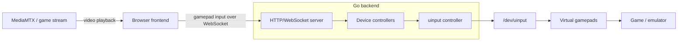

# virtual-gamepad

Browser-based controller sharing with a Go uinput gateway and Vite frontend.
The browser sends gamepad input through WebSockets, and the same page can embed a
low-latency game stream from a pluggable playback source.

## Architecture



## Game stream

The frontend reads stream playback config from `/config`, which is a static
public asset:

```json
{
  "stream": {
    "enabled": true,
    "playbackUrl": "http://example.com:8889/live",
    "label": "Game Stream"
  }
}
```

If no playback URL is configured, the controller UI still works and the stream
panel reports that no stream is configured. In Docker Compose,
`deploy/configs/config` is mounted over `/app/public/config`.

`PUBLIC_HOST` is still used for the player join URL and MediaMTX WebRTC
candidate config.

The current experiment uses:

```text
OBS or FFmpeg -> RTMP -> MediaMTX -> WebRTC viewer
```

In deployment, MediaMTX runs in the same Docker Compose project as the controller
gateway. Its config is mounted from `deploy/configs/mediamtx.yml`.

For a deployed MediaMTX server:

```text
RTMP ingest:     rtmp://<PUBLIC_HOST>:1935/live
WebRTC playback: http://<PUBLIC_HOST>:8889/live
LL-HLS fallback: http://<PUBLIC_HOST>:8888/live
```

MediaMTX keeps a static mounted config. `PUBLIC_HOST` is passed to MediaMTX as
`MTX_WEBRTCADDITIONALHOSTS` so
WebRTC viewers receive the externally reachable host in ICE candidates.
The backend always generates a room token and logs the tokenized player join URL
on startup.

WebRTC is the preferred path for interactive play because the observed latency
was sub-second. LL-HLS can remain a compatibility fallback, but it is too latent
for responsive gameplay.

If the controller UI is served over HTTPS, browsers will block an `http://`
stream iframe as mixed content. In that deployment, expose the stream over HTTPS
too, for example through the same public routing layer or an HTTPS-capable stream
frontend.

Container images are published from `main` to GitHub Container Registry:

```text
ghcr.io/0x28f4/virtual-gamepad:latest
```

## Run locally

Install dependencies:

```sh
make setup
```

Run checks:

```sh
make test
```

Build the frontend assets into the Go backend public directory and run the
gateway:

```sh
make run
```

The gateway needs `/dev/uinput`, so run it with permission to create uinput
devices. It logs the generated join URL or token on startup. By default it
serves `backend/public` on `http://localhost:8788`.
